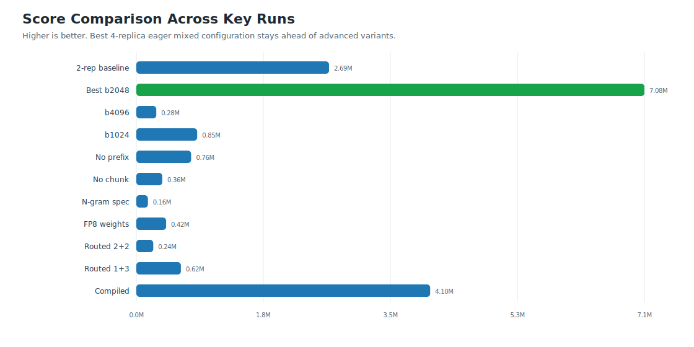
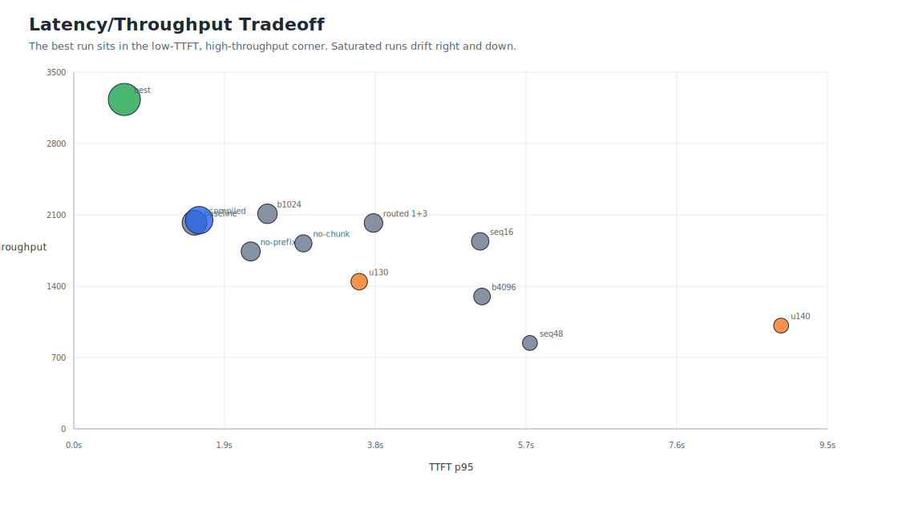
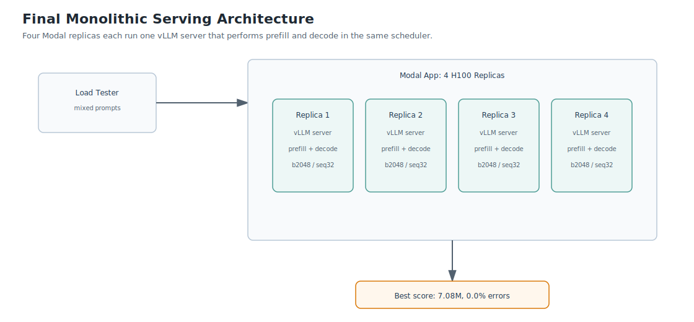
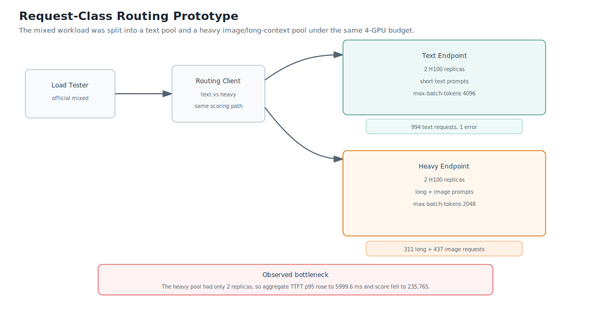
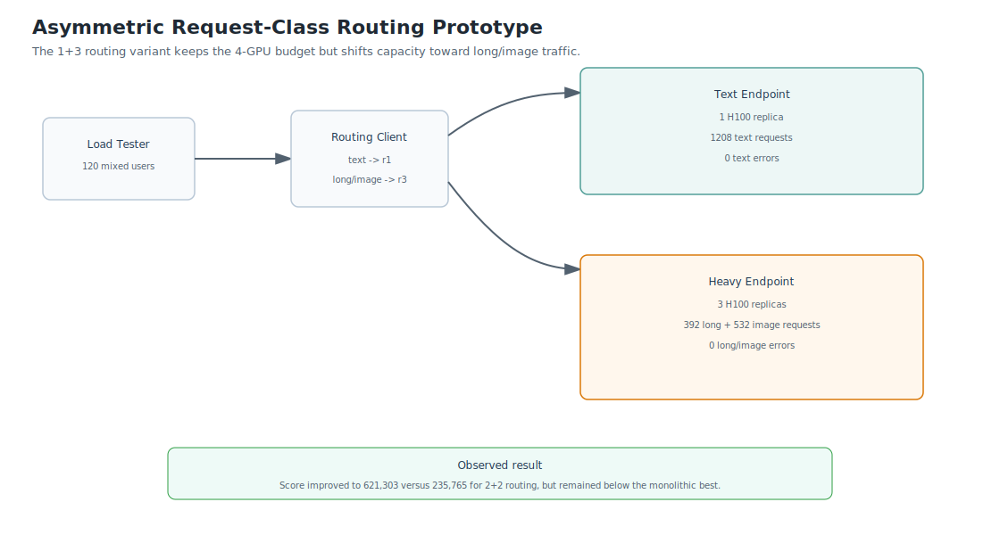
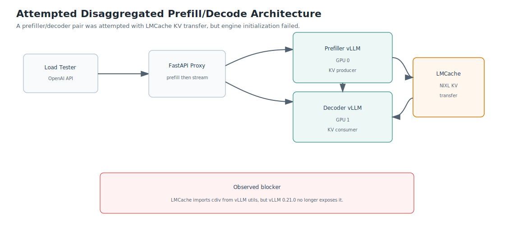

# InferTutor Arena Experiment Report

Author: Harshavardhana Srinivasan

Project: LLM inference engineering study using vLLM on Modal-hosted GPUs.

Model: `Qwen/Qwen3-VL-4B-Instruct`

Serving stack: Modal GPU containers, vLLM OpenAI-compatible server, async streaming load tester.

## High Level Summary

This project optimized an InferTutor multimodal serving endpoint under concurrent load using Modal-hosted H100 GPUs and vLLM. The final best configuration was a 4-replica mixed endpoint using `max-seqs=32`, `max-batch-tokens=2048`, prefix caching enabled, and chunked prefill enabled. It achieved a score of **7,084,876** with 0.0% errors, TTFT p95 of 638.0 ms, ITL p95 of 21.4 ms, and throughput of 3231.5 chunks/s.

The strongest finding is that mixed multimodal performance depends more on scheduler balance than on any single advanced feature. The best run came from controlling prefill/decode interference with the right batch-token budget and sequence concurrency. More exotic execution paths such as N-gram speculative decoding, online FP8 weight quantization, request-class routing, and compiled mode all regressed under the fixed 4-GPU mixed workload. A true disaggregated prefill/decode prototype was also attempted, but it failed during engine initialization because the available LMCache package was not compatible with `vllm==0.21.0`.

Compared with prior 4-GPU mixed baselines, this study improved beyond the simpler mixed-product configurations. Much larger scores in adjacent benchmark settings came primarily from text-only/boss-fight runs using compiled mode, high replica counts, and sometimes B200 hardware. Those results are not direct apples-to-apples comparisons to our 4-GPU mixed product-track study.

## Final Configuration

```bash
python run_infertutor_experiment.py --label mixed-r4-b2048-u120 --gpu-type H100 --replicas 4 --max-seqs 32 --max-batch-tokens 2048 --mode mixed --users 120 --duration 90 --ramp-up 30 --max-tokens 96
```

| Setting | Value |
|---|---:|
| Model | `Qwen/Qwen3-VL-4B-Instruct` |
| Mode | `mixed` |
| GPU type | H100 |
| Replicas | 4 |
| Total GPUs | 4 |
| Users | 120 |
| Ramp-up | 30 s |
| Duration | 90 s |
| Max tokens | 96 |
| Max sequences | 32 |
| Max batched tokens | 2048 |
| Prefix caching | Enabled |
| Chunked prefill | Enabled |
| Modal concurrency | Default 64 |

Final best result:

| Metric | Value |
|---|---:|
| Score | **7,084,876** |
| TTFT p95 | 638.0 ms |
| ITL p95 | 21.4 ms |
| Throughput | 3231.5 chunks/s |
| Error rate | 0.0% |
| Result JSON | `mixed-r4-b2048-u120_mixed_120u_1783186496.json` |

## Key Findings

1. The best mixed configuration was `b2048/seq32/u120` on 4 H100 replicas. It beat our two-replica mixed baseline by 2.6x and beat the simpler 4-GPU mixed baselines.

2. `max-batch-tokens=2048` was the key scheduler setting. `b4096` allowed prefill-heavy image/long requests to dominate scheduling windows, while `b1024` sliced work too aggressively and hurt utilization.

3. Prefix caching and chunked prefill were both essential. Disabling either feature sharply increased TTFT/ITL and collapsed score.

4. The useful density knee was below 130 users for this 4-replica mixed configuration. `120` users was stable, while `130` and `140` users caused queueing collapse or errors.

5. `max-seqs=32` was the best observed sequence-concurrency setting. Both `seq16` and `seq48` regressed badly, showing that the workload needs a balanced active-sequence window.

6. Novel execution-path features were not automatically beneficial. N-gram speculative decoding, online FP8 weight quantization, Modal ingress gating, and compiled mode all made the best mixed configuration worse.

7. Request-class routing improved when moving from a 2+2 split to a 1+3 split. The 2+2 design constrained the heavy endpoint, while the 1+3 design shifted more capacity to long/image requests and raised score from 235,765 to 621,303. Even so, both routed variants remained below the tuned single 4-replica mixed pool.

8. Compiled mode was only a partial transfer from text-heavy settings: it improved ITL p95 sharply, but worsened TTFT and reduced throughput enough that the overall mixed score stayed below the eager best.

9. True disaggregated prefill/decode serving is promising but was not operational in this environment. The prototype reached vLLM startup, but both prefiller and decoder crashed in LMCache integration because `lmcache.integration.vllm.vllm_v1_adapter` imported `cdiv` from `vllm.utils`, which is not exposed by the installed `vllm==0.21.0`.

## Comparison Context

Several earlier benchmark settings optimized partially different objectives:

| Result Category | Context | Score |
|---|---|---:|
| Prior mixed result A | 4-GPU mixed | ~6.37M |
| Prior mixed result B | 4-GPU mixed `b2048/seq32` | ~3.06M |
| Advanced/boss-style result | Mostly text, 8-10 GPUs, compiled/B200 variants | 100M+ to 600M+ |
| This study final best | 4-GPU mixed product track | **7.08M** |

The direct comparison is the 4-GPU mixed product track. On that track, this study improved beyond the simpler mixed baselines. The highest scores came from a different regime: text mode, more GPUs, compiled/CUDA graph mode, longer ramp-up, and in some cases B200 hardware.

## Visual Summary

The following plots and architecture diagrams summarize the central performance story of the study.







## Objective

This study aims to optimize an InferTutor serving endpoint under concurrent load. We will measure time to first token, inter-token latency, throughput, error rate, and GPU efficiency, then use controlled ablations to improve the final score.

The starter harness uses a throughput-normalized latency efficiency score:

```text
score = goodput_chunks_per_second * users / (ttft_p95_seconds * itl_p95_seconds * total_gpus)
```

where:

- `goodput_chunks_per_second = aggregate_stream_chunks_per_s * (1 - error_rate)`
- `ttft_p95_seconds = ttft_p95_ms / 1000`
- `itl_p95_seconds = itl_p95_ms / 1000`

This formula intentionally combines four serving objectives:

- **Sustained useful output:** `goodput_chunks_per_second` measures streamed output after discounting failed requests. A high raw throughput number is not rewarded if a meaningful fraction of requests fail.
- **Concurrent user support:** multiplying by `users` rewards configurations that keep more simultaneous clients active without collapsing p95 latency.
- **Tail latency control:** dividing by p95 TTFT and p95 ITL penalizes slow first-token response and slow token streaming. The p95 choice matters because users experience tail latency during load spikes, not only average latency.
- **GPU efficiency:** dividing by `total_gpus` prevents a configuration from winning only by using more hardware. Additional replicas must produce enough latency or throughput improvement to justify their cost.

In this report, the score is used as a comparative engineering metric rather than a standalone product metric. A better score generally means the endpoint achieved a stronger balance of throughput, concurrency, latency, reliability, and GPU cost for the same workload.

## Experimental Principles

- Change one major serving variable at a time.
- Prefer p95 latency and error rate over average-only interpretations.
- Treat failed or worse-performing experiments as useful evidence.
- Keep exact commands and result JSON filenames for reproducibility.
- Stop Modal apps after experiments to control cost.

## Initial Hypotheses

The initial readings and early runs suggested several useful starting hypotheses:

- Text-only traffic benefits strongly from compiled mode, but mixed multimodal traffic may not.
- Mixed traffic often benefits from smaller batch-token budgets because image and long-context prefills can block short decode work.
- `max-seqs 32` is a strong default.
- Prefix caching can help or hurt depending on prefix length, concurrency, and workload shape.
- FP8 KV cache on H100 is unlikely to help because decode-time dequantization can raise ITL.
- A novel but riskier direction is request-class specialization: serving text and image/long requests with different endpoint configurations.

## Result Summary

| # | Experiment Name | Label | Mode | Users | GPUs | TTFT p95 | ITL p95 | Throughput | Error | Score | Result JSON |
|---|---|---|---:|---:|---:|---:|---:|---:|---:|---:|---|
| 0 | Smoke validation | smoke | text | 5 | 1 | 1021.8 ms | 20.9 ms | 130.9 chunks/s | 0.0% | 30,638 | `smoke_text_5u_1783184553.json` |
| 1 | Text baseline | baseline-text-r1 | text | 50 | 1 | 1155.5 ms | 24.7 ms | 1076.7 chunks/s | 2.0% | 1,849,412 | `baseline-text-r1_text_50u_1783184910.json` |
| 2 | **Top 3 - Text-only single-replica knee** | text-r1-u40 | text | 40 | 1 | 816.6 ms | 16.8 ms | 1156.5 chunks/s | 0.0% | **3,380,964** | `text-r1-u40_text_40u_1783185432.json` |
| 3 | Mixed two-replica baseline | baseline-mixed-r2 | mixed | 100 | 2 | 1522.0 ms | 24.7 ms | 2022.4 chunks/s | 0.0% | 2,687,395 | `baseline-mixed-r2_mixed_100u_1783186000.json` |
| 4 | **Top 1 - Final best mixed scheduler** | mixed-r4-b2048-u120 | mixed | 120 | 4 | 638.0 ms | 21.4 ms | 3231.5 chunks/s | 0.0% | **7,084,876** | `mixed-r4-b2048-u120_mixed_120u_1783186496.json` |
| 5 | Large batch-token control | mixed-r4-b4096-u120 | mixed | 120 | 4 | 5146.4 ms | 27.2 ms | 1298.5 chunks/s | 0.0% | 277,960 | `mixed-r4-b4096-u120_mixed_120u_1783188479.json` |
| 6 | Small batch-token control | mixed-r4-b1024-u120 | mixed | 120 | 4 | 2441.9 ms | 30.6 ms | 2110.4 chunks/s | 0.0% | 848,382 | `mixed-r4-b1024-u120_mixed_120u_1783190482.json` |
| 7 | Prefix-cache ablation | mixed-r4-b2048-u120-noprefix | mixed | 120 | 4 | 2230.8 ms | 30.6 ms | 1740.5 chunks/s | 0.0% | 763,930 | `mixed-r4-b2048-u120-noprefix_mixed_120u_1783191286.json` |
| 8 | Chunked-prefill ablation | mixed-r4-b2048-u120-nochunk | mixed | 120 | 4 | 2894.8 ms | 52.1 ms | 1820.3 chunks/s | 0.0% | 362,350 | `mixed-r4-b2048-u120-nochunk_mixed_120u_1783191838.json` |
| 9 | Low sequence-concurrency control | mixed-r4-b2048-seq16-u120 | mixed | 120 | 4 | 5123.3 ms | 26.0 ms | 1839.6 chunks/s | 0.0% | 414,232 | `mixed-r4-b2048-seq16-u120_mixed_120u_1783192232.json` |
| 10 | 140-user saturation test | mixed-r4-b2048-u140 | mixed | 140 | 4 | 8916.0 ms | 51.0 ms | 1013.0 chunks/s | 0.0% | 77,971 | `mixed-r4-b2048-u140_mixed_140u_1783192699.json` |
| 11 | 130-user saturation test | mixed-r4-b2048-u130 | mixed | 130 | 4 | 3597.6 ms | 49.2 ms | 1444.4 chunks/s | 0.4% | 264,239 | `mixed-r4-b2048-u130_mixed_130u_1783193103.json` |
| 12 | High sequence-concurrency control | mixed-r4-b2048-seq48-u120 | mixed | 120 | 4 | 5749.6 ms | 50.6 ms | 842.6 chunks/s | 0.0% | 86,828 | `mixed-r4-b2048-seq48-u120_mixed_120u_1783193652.json` |
| 13 | N-gram speculative decoding | mixed-r4-b2048-ngram4-u120-r3 | mixed | 120 | 4 | 4846.7 ms | 50.3 ms | 1313.2 chunks/s | 0.0% | 161,525 | `mixed-r4-b2048-ngram4-u120-r3_mixed_120u_1783196706.json` |
| 14 | Online FP8 weight quantization | mixed-r4-b2048-fp8w-u120 | mixed | 120 | 4 | 3173.7 ms | 33.8 ms | 1561.1 chunks/s | 4.8% | 415,360 | `mixed-r4-b2048-fp8w-u120_mixed_120u_1783197169.json` |
| 15 | Modal concurrency gate | mixed-r4-b2048-ci32-u120 | mixed | 120 | 4 | 3199.5 ms | 35.7 ms | 1533.2 chunks/s | 2.1% | 394,868 | `mixed-r4-b2048-ci32-u120_mixed_120u_1783197933.json` |
| 16 | Request-class routing, 2+2 split | routed-text2-heavy2-u120 | routed | 120 | 4 | 5999.6 ms | 33.3 ms | 1573.4 chunks/s | 0.1% | 235,765 | `routed-text2-heavy2-u120_routed_120u_1783198666.json` |
| 16b | Request-class routing, 1+3 split | routed-text1-heavy3-u120 | routed | 120 | 4 | 3777.8 ms | 25.8 ms | 2019.7 chunks/s | 0.0% | 621,303 | `routed-text1-heavy3-u120_routed_120u_1783269742.json` |
| 17 | **Top 2 - Compiled mixed execution** | mixed-r4-b2048-compiled-u120 | mixed | 120 | 4 | 1580.7 ms | 9.5 ms | 2047.4 chunks/s | 0.0% | **4,097,013** | `mixed-r4-b2048-compiled-u120_mixed_120u_1783199261.json` |

## Experiment Log

### Experiment 0: Smoke Test

Purpose: Validate Modal authentication, Hugging Face secret access, vLLM startup, endpoint health, and local load testing.

Command:

```bash
python run_infertutor_experiment.py --label smoke --gpu-type H100 --replicas 1 --mode text --users 5 --duration 30 --ramp-up 5 --max-tokens 64
```

Result file:

```text
starter_code/results_infertutor/smoke_text_5u_1783184553.json
```

Metrics:

| Metric | Value |
|---|---:|
| Total requests | 62 |
| Errors | 0 |
| Error rate | 0.0% |
| TTFT p50 | 357.7 ms |
| TTFT p95 | 1021.8 ms |
| TTFT p99 | 1625.9 ms |
| ITL p50 | 18.0 ms |
| ITL p95 | 20.9 ms |
| Latency p95 | 2014.4 ms |
| Throughput | 130.9 chunks/s |
| Requests/s | 2.06 |
| Score | 30,638 |

Interpretation:

The smoke test passed with zero errors. This confirms the end-to-end infrastructure is functioning: Modal can launch the vLLM server, the Hugging Face secret is accessible, the endpoint becomes healthy, and the load tester can stream completions successfully.

Result:

Smoke test completed successfully with 0.0% errors, TTFT p95 of 1021.8 ms, ITL p95 of 20.9 ms, and throughput of 130.9 chunks/s. The computed score was 30,638.

Key Finding:

The infrastructure is valid. Any later performance issue should be interpreted as a serving-configuration or workload-pressure problem, not a basic Modal, Hugging Face, vLLM, or load-tester setup failure.

Decision:

Keep as infrastructure validation only. This is not a performance baseline because the user count is intentionally tiny.

### Experiment 1: Single-GPU Text Baseline

Purpose: Establish a first real text-only baseline on one H100 using the default starter serving knobs.

Command:

```bash
python run_infertutor_experiment.py --label baseline-text-r1 --gpu-type H100 --replicas 1 --max-seqs 32 --max-batch-tokens 4096 --mode text --users 50 --duration 60 --ramp-up 15 --max-tokens 96
```

Result file:

```text
starter_code/results_infertutor/baseline-text-r1_text_50u_1783184910.json
```

Metrics:

| Metric | Value |
|---|---:|
| Total requests | 692 |
| Errors | 14 |
| Error rate | 2.0% |
| TTFT p50 | 527.2 ms |
| TTFT p95 | 1155.5 ms |
| TTFT p99 | 4690.2 ms |
| ITL p50 | 23.0 ms |
| ITL p95 | 24.7 ms |
| Latency p95 | 6551.1 ms |
| Throughput | 1076.7 chunks/s |
| Requests/s | 11.48 |
| Score | 1,849,412 |

Interpretation:

This baseline produced reasonable throughput but had a nonzero error rate and a large p99 TTFT spike. The system is already under enough pressure at 50 users that request tail latency and reliability matter. Before treating this as a clean baseline, we should either reduce concurrency slightly or compare against a configuration expected to handle 50 users better.

Result:

The 1-GPU eager text baseline served 50 users with 1076.7 chunks/s throughput, but produced 14 failed requests out of 692 total requests. Error rate was 2.0%, TTFT p95 was 1155.5 ms, ITL p95 was 24.7 ms, and score was 1,849,412.

Key Finding:

At 50 users, the single eager H100 is not yet a clean reliability baseline. Throughput increased substantially compared with smoke, but p99 TTFT reached 4690.2 ms and errors appeared. This suggests the next study should reduce load or increase warmup/ramp before drawing conclusions from single-GPU eager text performance.

Decision:

Keep as the first real baseline, but do not use it as a final-quality run because of the 2.0% error rate.

### Experiment 2: Lower-Pressure Single-GPU Text Baseline

Purpose: Determine whether the 50-user text baseline errors were caused by overload/transient queue pressure, and establish a cleaner 1-GPU eager text baseline.

Command:

```bash
python run_infertutor_experiment.py --label text-r1-u40 --gpu-type H100 --replicas 1 --max-seqs 32 --max-batch-tokens 4096 --mode text --users 40 --duration 60 --ramp-up 20 --max-tokens 96
```

Result file:

```text
starter_code/results_infertutor/text-r1-u40_text_40u_1783185432.json
```

Metrics:

| Metric | Value |
|---|---:|
| Total requests | 728 |
| Errors | 0 |
| Error rate | 0.0% |
| TTFT p50 | 552.3 ms |
| TTFT p95 | 816.6 ms |
| TTFT p99 | 1134.7 ms |
| ITL p50 | 14.9 ms |
| ITL p95 | 16.8 ms |
| Latency p95 | 2295.6 ms |
| Throughput | 1156.5 chunks/s |
| Requests/s | 12.08 |
| Score | 3,380,964 |

Interpretation:

Reducing the single-GPU text load from 50 users to 40 users eliminated all request errors and improved p95 latency. TTFT p95 dropped from 1155.5 ms to 816.6 ms, ITL p95 dropped from 24.7 ms to 16.8 ms, and throughput still improved from 1076.7 chunks/s to 1156.5 chunks/s. Even with fewer users in the score numerator, the cleaner latency profile produced a much better score.

Result:

The lower-pressure 1-GPU text run served 40 users with 0.0% errors, 1156.5 chunks/s throughput, TTFT p95 of 816.6 ms, ITL p95 of 16.8 ms, and score of 3,380,964. This is an 83% score improvement over the 50-user eager baseline.

Key Finding:

For single-GPU eager text serving, the score optimum is not simply the highest user count. The 50-user run had slightly more concurrency but paid for it through errors, worse TTFT, worse ITL, and a severe p99 tail. At 40 users, the GPU remained well utilized while the queue stayed healthier, producing both higher throughput and lower tail latency.

Decision:

Use `text-r1-u40` as the clean eager text baseline. Move next to mixed-mode benchmarking because the main capstone track is multimodal product serving, not pure text.

### Experiment 3: Two-Replica Mixed Baseline

Purpose: Establish the first official multimodal product-track anchor using the default mixed-mode starter configuration with 2 H100 replicas.

Command:

```bash
python run_infertutor_experiment.py --label baseline-mixed-r2 --gpu-type H100 --replicas 2 --max-seqs 32 --max-batch-tokens 4096 --mode mixed --users 100 --duration 90 --ramp-up 25 --max-tokens 96
```

Result file:

```text
starter_code/results_infertutor/baseline-mixed-r2_mixed_100u_1783186000.json
```

Metrics:

| Metric | Value |
|---|---:|
| Total requests | 1999 |
| Errors | 0 |
| Error rate | 0.0% |
| TTFT p50 | 808.4 ms |
| TTFT p95 | 1522.0 ms |
| TTFT p99 | 1851.5 ms |
| ITL p50 | 21.6 ms |
| ITL p95 | 24.7 ms |
| Latency p95 | 3593.4 ms |
| Throughput | 2022.4 chunks/s |
| Requests/s | 21.96 |
| Score | 2,687,395 |

Interpretation:

The two-replica mixed baseline was reliable: 100 users completed with 0.0% errors across 1999 requests. However, mixed traffic clearly increased prefill and scheduling pressure compared with the clean text baseline. TTFT p95 rose to 1522.0 ms, reflecting the heavier workload mix of text, long-context, and image prompts. ITL p95 was 24.7 ms, close to the overloaded 50-user single-GPU text run, which suggests mixed-mode decode smoothness is already being affected by heterogeneous request pressure.

Result:

The baseline mixed run served 100 users on 2 H100 replicas with 0.0% errors, 2022.4 chunks/s throughput, TTFT p95 of 1522.0 ms, ITL p95 of 24.7 ms, and score of 2,687,395.

Key Finding:

Two replicas are enough to make the mixed workload reliable at 100 users, but not enough to make it latency-optimal. The lack of errors says the endpoint is surviving, while the 1.5 second TTFT p95 shows image and long-context prefills are creating enough queue pressure to hurt responsiveness. This supports testing a mixed optimization strategy: more replicas plus a smaller batch-token budget to improve prefill/decode interleaving.

Decision:

Keep this as the official mixed baseline. Next, test the 4-replica `max-batch-tokens 2048` candidate, which is expected to reduce mixed-mode TTFT by chunking prefill work more aggressively across more replicas.

### Experiment 4: Four-Replica Mixed Run with Smaller Batch-Token Budget

Purpose: Test the hypothesis that 4 replicas plus a smaller `max-batch-tokens` value improves mixed-mode tail latency by spreading request pressure and forcing chunked prefill to interleave more aggressively with decode.

Command:

```bash
python run_infertutor_experiment.py --label mixed-r4-b2048-u120 --gpu-type H100 --replicas 4 --max-seqs 32 --max-batch-tokens 2048 --mode mixed --users 120 --duration 90 --ramp-up 30 --max-tokens 96
```

Result file:

```text
starter_code/results_infertutor/mixed-r4-b2048-u120_mixed_120u_1783186496.json
```

Metrics:

| Metric | Value |
|---|---:|
| Total requests | 3210 |
| Errors | 0 |
| Error rate | 0.0% |
| TTFT p50 | 362.8 ms |
| TTFT p95 | 638.0 ms |
| TTFT p99 | 1004.5 ms |
| ITL p50 | 19.2 ms |
| ITL p95 | 21.4 ms |
| Latency p95 | 2489.9 ms |
| Throughput | 3231.5 chunks/s |
| Requests/s | 34.98 |
| Score | 7,084,876 |

Interpretation:

This run substantially improved the mixed-mode baseline. Compared with the 2-replica mixed baseline, TTFT p95 dropped from 1522.0 ms to 638.0 ms, ITL p95 dropped from 24.7 ms to 21.4 ms, and throughput rose from 2022.4 chunks/s to 3231.5 chunks/s. Even after doubling the GPU denominator from 2 to 4, the score improved from 2,687,395 to 7,084,876.

Result:

The 4-replica `b2048` mixed run served 120 users with 0.0% errors, 3231.5 chunks/s throughput, TTFT p95 of 638.0 ms, ITL p95 of 21.4 ms, and score of 7,084,876. This is a 2.6x improvement over our 2-replica mixed baseline and clears the simpler prior 4-GPU mixed score of about 6.37M.

Key Finding:

For mixed multimodal traffic, the bottleneck was not only raw GPU count. The combination of horizontal scale-out and a smaller batch-token budget changed scheduler behavior: long and image prefills no longer dominated the queue as badly, so short requests reached first token faster. The sharp TTFT reduction confirms that mixed-mode optimization must prioritize prefill/decode interleaving, not just aggregate throughput.

Decision:

Use this as the current best mixed configuration. Next, isolate whether the improvement came mainly from replica count or from `max-batch-tokens 2048` by running a 4-replica mixed comparison with `max-batch-tokens 4096`.

### Experiment 5: Four-Replica Mixed Batch-Token Control

Purpose: Isolate the effect of `max-batch-tokens` by keeping replicas, users, mode, sequence count, ramp-up, and output length fixed while changing only the batch-token budget from 2048 back to 4096.

Command:

```bash
python run_infertutor_experiment.py --label mixed-r4-b4096-u120 --gpu-type H100 --replicas 4 --max-seqs 32 --max-batch-tokens 4096 --mode mixed --users 120 --duration 90 --ramp-up 30 --max-tokens 96
```

Result file:

```text
starter_code/results_infertutor/mixed-r4-b4096-u120_mixed_120u_1783188479.json
```

Metrics:

| Metric | Value |
|---|---:|
| Total requests | 1288 |
| Errors | 0 |
| Error rate | 0.0% |
| TTFT p50 | 4570.7 ms |
| TTFT p95 | 5146.4 ms |
| TTFT p99 | 6231.8 ms |
| ITL p50 | 22.4 ms |
| ITL p95 | 27.2 ms |
| Latency p95 | 7806.2 ms |
| Throughput | 1298.5 chunks/s |
| Requests/s | 14.15 |
| Score | 277,960 |

Interpretation:

This control run performed dramatically worse than the `b2048` configuration despite using the same 4 replicas and 120 users. TTFT p95 increased from 638.0 ms to 5146.4 ms, ITL p95 worsened from 21.4 ms to 27.2 ms, and throughput fell from 3231.5 chunks/s to 1298.5 chunks/s. The score collapsed from 7,084,876 to 277,960.

Result:

The 4-replica `b4096` mixed run completed with 0.0% errors, but latency and throughput were poor: TTFT p95 was 5146.4 ms, ITL p95 was 27.2 ms, throughput was 1298.5 chunks/s, and score was only 277,960.

Key Finding:

The `b2048` improvement was not merely a replica-count effect. With 4 replicas fixed, increasing `max-batch-tokens` to 4096 allowed prefill-heavy image and long-context requests to dominate scheduling windows, causing short requests to wait several seconds for first token. For this mixed workload, smaller batch-token budgets are essential because they force chunked prefill to yield more often and preserve responsiveness.

Decision:

Reject `b4096` for mixed traffic at 120 users. Keep `mixed-r4-b2048-u120` as the current best mixed configuration. Next, test a nearby lower batch-token budget, `b1024`, to see whether even more aggressive prefill slicing improves TTFT further or begins to underutilize the GPU.

### Experiment 6: Four-Replica Mixed Lower Batch-Token Sweep

Purpose: Test whether lowering `max-batch-tokens` from 2048 to 1024 further improves mixed-mode TTFT, or whether it slices work too aggressively and harms GPU utilization.

Command:

```bash
python run_infertutor_experiment.py --label mixed-r4-b1024-u120 --gpu-type H100 --replicas 4 --max-seqs 32 --max-batch-tokens 1024 --mode mixed --users 120 --duration 90 --ramp-up 30 --max-tokens 96
```

Result file:

```text
starter_code/results_infertutor/mixed-r4-b1024-u120_mixed_120u_1783190482.json
```

Metrics:

| Metric | Value |
|---|---:|
| Total requests | 2109 |
| Errors | 0 |
| Error rate | 0.0% |
| TTFT p50 | 701.8 ms |
| TTFT p95 | 2441.9 ms |
| TTFT p99 | 3782.1 ms |
| ITL p50 | 20.9 ms |
| ITL p95 | 30.6 ms |
| Latency p95 | 5089.5 ms |
| Throughput | 2110.4 chunks/s |
| Requests/s | 22.84 |
| Score | 848,382 |

Interpretation:

This run completed with zero errors, but performance was much worse than `b2048`. Compared with the current best `mixed-r4-b2048-u120`, TTFT p95 rose from 638.0 ms to 2441.9 ms, ITL p95 rose from 21.4 ms to 30.6 ms, and throughput dropped from 3231.5 chunks/s to 2110.4 chunks/s. The score dropped from 7,084,876 to 848,382.

Result:

The 4-replica `b1024` mixed run served 120 users with 0.0% errors, 2110.4 chunks/s throughput, TTFT p95 of 2441.9 ms, ITL p95 of 30.6 ms, and score of 848,382.

Key Finding:

There is a real batch-token sweet spot for this mixed workload. `b4096` allows prefill-heavy work to monopolize the scheduler, while `b1024` slices work so aggressively that throughput and decode smoothness suffer. `b2048` gives the best observed balance: frequent enough prefill yielding to protect TTFT, but large enough batches to keep GPU utilization healthy.

Decision:

Reject `b1024` for the current mixed configuration. Keep `mixed-r4-b2048-u120` as the best batch-token setting. Next, test prefix caching around this best mixed configuration to determine whether shared prompt reuse helps or whether cache bookkeeping adds overhead.

### Experiment 7: Prefix Cache Ablation on Best Mixed Configuration

Purpose: Determine whether prefix caching helps the current best mixed setup or whether cache bookkeeping overhead outweighs reuse benefits.

Command:

```bash
python run_infertutor_experiment.py --label mixed-r4-b2048-u120-noprefix --gpu-type H100 --replicas 4 --no-prefix-cache --max-seqs 32 --max-batch-tokens 2048 --mode mixed --users 120 --duration 90 --ramp-up 30 --max-tokens 96
```

Result file:

```text
starter_code/results_infertutor/mixed-r4-b2048-u120-noprefix_mixed_120u_1783191286.json
```

Metrics:

| Metric | Value |
|---|---:|
| Total requests | 1751 |
| Errors | 0 |
| Error rate | 0.0% |
| TTFT p50 | 785.5 ms |
| TTFT p95 | 2230.8 ms |
| TTFT p99 | 3859.8 ms |
| ITL p50 | 20.7 ms |
| ITL p95 | 30.6 ms |
| Latency p95 | 4011.2 ms |
| Throughput | 1740.5 chunks/s |
| Requests/s | 18.83 |
| Score | 763,930 |

Interpretation:

Disabling prefix caching severely degraded performance. Compared with the best cached run, TTFT p95 rose from 638.0 ms to 2230.8 ms, ITL p95 rose from 21.4 ms to 30.6 ms, and throughput fell from 3231.5 chunks/s to 1740.5 chunks/s. The score fell from 7,084,876 to 763,930.

Result:

The no-prefix-cache run completed with 0.0% errors, but performance was poor: TTFT p95 was 2230.8 ms, ITL p95 was 30.6 ms, throughput was 1740.5 chunks/s, and score was 763,930.

Key Finding:

Prefix caching is important for our best mixed configuration. Although prefix-cache overhead can appear at short prefix lengths, our mixed workload at 120 users and 4 replicas benefits strongly from reusing shared prompt state. The cache likely reduces repeated system-prompt and common-prefix prefill work enough to protect TTFT and throughput under heterogeneous load.

Decision:

Keep prefix caching enabled for mixed-mode optimization. Next, test chunked prefill by disabling it on the current best configuration. This should reveal whether the excellent `b2048` result depends on chunked prefill yielding behavior.

### Experiment 8: Chunked Prefill Ablation on Best Mixed Configuration

Purpose: Determine whether chunked prefill is required for the current best mixed-mode latency profile.

Command:

```bash
python run_infertutor_experiment.py --label mixed-r4-b2048-u120-nochunk --gpu-type H100 --replicas 4 --no-chunked-prefill --max-seqs 32 --max-batch-tokens 2048 --mode mixed --users 120 --duration 90 --ramp-up 30 --max-tokens 96
```

Result file:

```text
starter_code/results_infertutor/mixed-r4-b2048-u120-nochunk_mixed_120u_1783191838.json
```

Metrics:

| Metric | Value |
|---|---:|
| Total requests | 1833 |
| Errors | 0 |
| Error rate | 0.0% |
| TTFT p50 | 719.6 ms |
| TTFT p95 | 2894.8 ms |
| TTFT p99 | 4594.4 ms |
| ITL p50 | 26.1 ms |
| ITL p95 | 52.1 ms |
| Latency p95 | 6158.8 ms |
| Throughput | 1820.3 chunks/s |
| Requests/s | 19.68 |
| Score | 362,350 |

Interpretation:

Disabling chunked prefill caused a severe regression. Compared with the best configuration, TTFT p95 increased from 638.0 ms to 2894.8 ms, ITL p95 increased from 21.4 ms to 52.1 ms, and throughput fell from 3231.5 chunks/s to 1820.3 chunks/s. The score dropped from 7,084,876 to 362,350.

Result:

The no-chunked-prefill run completed with 0.0% errors, but latency and throughput degraded sharply: TTFT p95 was 2894.8 ms, ITL p95 was 52.1 ms, throughput was 1820.3 chunks/s, and score was 362,350.

Key Finding:

Chunked prefill is essential for mixed multimodal traffic. Without it, image and long-context prefills block decode progress and delay short requests, which damages both TTFT and ITL. The `b2048` win depends on chunked prefill yielding behavior: the smaller batch-token budget sets the chunk size, and chunked prefill makes those chunks schedulable between decode steps.

Decision:

Keep chunked prefill enabled. The current best mixed configuration remains `replicas=4`, `max-seqs=32`, `max-batch-tokens=2048`, prefix caching enabled, chunked prefill enabled. Next, test `max-seqs` around this configuration to see whether sequence concurrency can be widened or narrowed profitably.

### Experiment 9: Max-Seqs 16 Sweep on Best Mixed Configuration

Purpose: Test whether reducing `max-seqs` from 32 to 16 improves mixed-mode p95 latency by limiting per-replica concurrency, or whether it starves the scheduler and causes queue buildup.

Command:

```bash
python run_infertutor_experiment.py --label mixed-r4-b2048-seq16-u120 --gpu-type H100 --replicas 4 --max-seqs 16 --max-batch-tokens 2048 --mode mixed --users 120 --duration 90 --ramp-up 30 --max-tokens 96
```

Result file:

```text
starter_code/results_infertutor/mixed-r4-b2048-seq16-u120_mixed_120u_1783192232.json
```

Metrics:

| Metric | Value |
|---|---:|
| Total requests | 1802 |
| Errors | 0 |
| Error rate | 0.0% |
| TTFT p50 | 1609.4 ms |
| TTFT p95 | 5123.3 ms |
| TTFT p99 | 6265.1 ms |
| ITL p50 | 19.7 ms |
| ITL p95 | 26.0 ms |
| Latency p95 | 7069.5 ms |
| Throughput | 1839.6 chunks/s |
| Requests/s | 19.91 |
| Score | 414,232 |

Interpretation:

Reducing `max-seqs` to 16 was harmful. Compared with the current best `seq32` run, TTFT p95 increased from 638.0 ms to 5123.3 ms, ITL p95 increased from 21.4 ms to 26.0 ms, and throughput dropped from 3231.5 chunks/s to 1839.6 chunks/s. The score fell from 7,084,876 to 414,232.

Result:

The `seq16` mixed run completed reliably with 0.0% errors, but the latency profile was poor: TTFT p95 was 5123.3 ms, ITL p95 was 26.0 ms, throughput was 1839.6 chunks/s, and score was 414,232.

Key Finding:

For this mixed workload, `max-seqs=16` is too restrictive. It likely reduces the number of active requests each replica can keep in flight, causing request queues to grow before work reaches vLLM. The result confirms that our best configuration needs enough sequence concurrency to absorb heterogeneous text, long-context, and image requests while chunked prefill handles fairness inside the scheduler.

Decision:

Reject `max-seqs=16` for the 4-replica mixed configuration. Keep `max-seqs=32` as the best observed setting. The next useful test is either a higher `max-seqs` value such as 48, or a user-density sweep around the current best to see whether the endpoint can exploit more load without losing its latency advantage.

### Experiment 10: User-Density Sweep on Current Best Mixed Configuration

Purpose: Test whether the current best configuration can support more users while keeping TTFT and ITL controlled. Since score scales with user count when latency stays healthy, this experiment probes whether 120 users is conservative or near the operating knee.

Command:

```bash
python run_infertutor_experiment.py --label mixed-r4-b2048-u140 --gpu-type H100 --replicas 4 --max-seqs 32 --max-batch-tokens 2048 --mode mixed --users 140 --duration 90 --ramp-up 30 --max-tokens 96
```

Result file:

```text
starter_code/results_infertutor/mixed-r4-b2048-u140_mixed_140u_1783192699.json
```

Metrics:

| Metric | Value |
|---|---:|
| Total requests | 1030 |
| Errors | 0 |
| Error rate | 0.0% |
| TTFT p50 | 1620.0 ms |
| TTFT p95 | 8916.0 ms |
| TTFT p99 | 13432.0 ms |
| ITL p50 | 19.5 ms |
| ITL p95 | 51.0 ms |
| Latency p95 | 12759.7 ms |
| Throughput | 1013.0 chunks/s |
| Requests/s | 11.05 |
| Score | 77,971 |

Interpretation:

Increasing users from 120 to 140 caused a severe saturation collapse. Compared with the best 120-user run, TTFT p95 increased from 638.0 ms to 8916.0 ms, ITL p95 increased from 21.4 ms to 51.0 ms, and throughput dropped from 3231.5 chunks/s to 1013.0 chunks/s. Even though the score numerator gained 20 users, the latency denominator became so large that score fell from 7,084,876 to 77,971.

Result:

The 140-user density run completed with 0.0% errors, but the endpoint was overloaded: TTFT p95 was 8916.0 ms, ITL p95 was 51.0 ms, throughput was 1013.0 chunks/s, and score was only 77,971.

Key Finding:

The current 4-replica `b2048/seq32` configuration has a sharp operating knee between 120 and 140 mixed users. Zero errors are misleading here: the service remained alive, but queueing delay and decode interference became unacceptable. This confirms that the 120-user result is not simply under-loaded; it is close to the best observed balance of concurrency, throughput, and latency for this configuration.

Decision:

Reject 140 users for the 4-replica mixed submission candidate. Keep `mixed-r4-b2048-u120` as the best stable mixed configuration so far. The next useful density check is a narrower point such as 125 or 130 users, or a `max-seqs=48` run at 120 users to see whether extra in-flight sequence capacity can absorb load without recreating the 140-user latency collapse.

### Experiment 11: Narrow 130-User Density Check

Purpose: Determine whether the collapse at 140 users begins gradually or whether a nearby middle point can improve over the 120-user best by adding score numerator without excessive tail-latency penalty.

Command:

```bash
python run_infertutor_experiment.py --label mixed-r4-b2048-u130 --gpu-type H100 --replicas 4 --max-seqs 32 --max-batch-tokens 2048 --mode mixed --users 130 --duration 90 --ramp-up 30 --max-tokens 96
```

Result file:

```text
starter_code/results_infertutor/mixed-r4-b2048-u130_mixed_130u_1783193103.json
```

Metrics:

| Metric | Value |
|---|---:|
| Total requests | 1655 |
| Errors | 6 |
| Error rate | 0.4% |
| TTFT p50 | 952.2 ms |
| TTFT p95 | 3597.6 ms |
| TTFT p99 | 9346.6 ms |
| ITL p50 | 19.1 ms |
| ITL p95 | 49.2 ms |
| Latency p95 | 9113.9 ms |
| Throughput | 1444.4 chunks/s |
| Requests/s | 15.76 |
| Score | 264,239 |

Interpretation:

The 130-user point still overloaded the service. It was less extreme than the 140-user run, but it was far worse than the 120-user best. Compared with `mixed-r4-b2048-u120`, TTFT p95 rose from 638.0 ms to 3597.6 ms, ITL p95 rose from 21.4 ms to 49.2 ms, throughput fell from 3231.5 chunks/s to 1444.4 chunks/s, and 6 request errors appeared. The score fell from 7,084,876 to 264,239.

Result:

The 130-user density run was not a viable improvement. It produced 0.4% errors, TTFT p95 of 3597.6 ms, ITL p95 of 49.2 ms, throughput of 1444.4 chunks/s, and score of 264,239.

Key Finding:

The saturation knee is below 130 mixed users for this 4-replica configuration. The failure pattern starts before full request errors dominate: TTFT and ITL tail latency deteriorate sharply as queues grow and decode work competes with heavy prefill. This strengthens the case that 120 users is the best stable density among the tested points.

Decision:

Reject 130 users. Keep 120 users as the stable mixed-density setting. Further gains should come from scheduler/concurrency changes, routing strategies, or quantization experiments rather than pushing raw user count higher on the same `b2048/seq32` setup.

### Experiment 12: Max-Seqs 48 Expansion at Stable Density

Purpose: Test whether increasing active sequence capacity from 32 to 48 improves the stable 120-user configuration, or whether wider in-flight concurrency increases scheduler pressure and hurts tail latency.

Command:

```bash
python run_infertutor_experiment.py --label mixed-r4-b2048-seq48-u120 --gpu-type H100 --replicas 4 --max-seqs 48 --max-batch-tokens 2048 --mode mixed --users 120 --duration 90 --ramp-up 30 --max-tokens 96
```

Result file:

```text
starter_code/results_infertutor/mixed-r4-b2048-seq48-u120_mixed_120u_1783193652.json
```

Metrics:

| Metric | Value |
|---|---:|
| Total requests | 835 |
| Errors | 0 |
| Error rate | 0.0% |
| TTFT p50 | 1771.9 ms |
| TTFT p95 | 5749.6 ms |
| TTFT p99 | 10591.4 ms |
| ITL p50 | 27.2 ms |
| ITL p95 | 50.6 ms |
| Latency p95 | 9718.3 ms |
| Throughput | 842.6 chunks/s |
| Requests/s | 9.11 |
| Score | 86,828 |

Interpretation:

Increasing `max-seqs` to 48 produced a severe regression. Compared with the best `seq32` run, TTFT p95 increased from 638.0 ms to 5749.6 ms, ITL p95 increased from 21.4 ms to 50.6 ms, and throughput dropped from 3231.5 chunks/s to 842.6 chunks/s. The score fell from 7,084,876 to 86,828.

Result:

The `seq48` run completed with 0.0% errors, but it was overloaded from a latency perspective: TTFT p95 was 5749.6 ms, ITL p95 was 50.6 ms, throughput was 842.6 chunks/s, and score was 86,828.

Key Finding:

The best mixed configuration is sensitive to active sequence capacity. `seq16` was too narrow and caused queue buildup, while `seq48` allowed too many active sequences and likely increased decode/prefill contention. `max-seqs=32` is the best observed balance: enough concurrency to keep replicas productive, but not so much that tail latency collapses.

Decision:

Reject `max-seqs=48`. Keep `max-seqs=32` as the confirmed best sequence-concurrency setting among 16, 32, and 48. Move next to a more novel execution-path ablation: lightweight N-gram speculative decoding.

### Experiment 13: N-Gram Speculative Decoding on Best Mixed Configuration

Purpose: Test a lightweight speculative decoding method that does not require a separate draft model or model-specific Medusa/EAGLE heads. This targets decode efficiency and ITL while keeping the same mixed-product workload and stable 120-user density.

Command:

```bash
python run_infertutor_experiment.py --label mixed-r4-b2048-ngram4-u120-r3 --gpu-type H100 --replicas 4 --max-seqs 32 --max-batch-tokens 2048 --mode mixed --users 120 --duration 90 --ramp-up 30 --max-tokens 96 --speculative-ngram-tokens 4 --speculative-ngram-min 2 --speculative-ngram-max 5
```

Result file:

```text
starter_code/results_infertutor/mixed-r4-b2048-ngram4-u120-r3_mixed_120u_1783196706.json
```

Metrics:

| Metric | Value |
|---|---:|
| Total requests | 1412 |
| Errors | 0 |
| Error rate | 0.0% |
| TTFT p50 | 1173.3 ms |
| TTFT p95 | 4846.7 ms |
| TTFT p99 | 7601.7 ms |
| ITL p50 | 33.5 ms |
| ITL p95 | 50.3 ms |
| Latency p95 | 9270.7 ms |
| Throughput | 1313.2 chunks/s |
| Requests/s | 15.08 |
| Score | 161,525 |

Interpretation:

N-gram speculative decoding was not beneficial for this mixed multimodal workload. Compared with the best non-speculative run, TTFT p95 increased from 638.0 ms to 4846.7 ms, ITL p95 increased from 21.4 ms to 50.3 ms, and throughput fell from 3231.5 chunks/s to 1313.2 chunks/s. The score dropped from 7,084,876 to 161,525.

Result:

The N-gram run completed successfully with 0.0% errors, but performance regressed sharply: TTFT p95 was 4846.7 ms, ITL p95 was 50.3 ms, throughput was 1313.2 chunks/s, and score was 161,525.

Key Finding:

Lightweight speculative decoding did not help the mixed InferTutor workload. The overhead and scheduling disruption outweighed any decode benefit, likely because the benchmark includes heterogeneous image, long-context, and text requests where TTFT and prefill/decode interference dominate. This is an important negative result: speculation is not automatically useful when the bottleneck is mixed-workload scheduling rather than pure autoregressive decode.

Decision:

Reject N-gram speculative decoding for the final mixed submission. Keep the non-speculative `mixed-r4-b2048-u120` configuration as the best overall result. Move next to quantization as the final novel execution-path study.

### Experiment 14: Online FP8 Weight Quantization

Purpose: Test a novel weight-quantization path distinct from FP8 KV cache on the best mixed configuration. This checks whether lower-precision weights improve memory bandwidth or throughput enough to offset quantization overhead.

Command:

```bash
python run_infertutor_experiment.py --label mixed-r4-b2048-fp8w-u120 --gpu-type H100 --replicas 4 --max-seqs 32 --max-batch-tokens 2048 --mode mixed --users 120 --duration 90 --ramp-up 30 --max-tokens 96 --vllm-arg=--quantization --vllm-arg fp8_per_tensor
```

Result file:

```text
starter_code/results_infertutor/mixed-r4-b2048-fp8w-u120_mixed_120u_1783197169.json
```

Metrics:

| Metric | Value |
|---|---:|
| Total requests | 1610 |
| Errors | 78 |
| Error rate | 4.8% |
| TTFT p50 | 973.1 ms |
| TTFT p95 | 3173.7 ms |
| TTFT p99 | 5263.4 ms |
| ITL p50 | 21.3 ms |
| ITL p95 | 33.8 ms |
| Latency p95 | 5010.9 ms |
| Throughput | 1561.1 chunks/s |
| Requests/s | 17.56 |
| Score | 415,360 |

Interpretation:

Online FP8 weight quantization did not improve the best mixed configuration. Compared with the non-quantized best run, TTFT p95 increased from 638.0 ms to 3173.7 ms, ITL p95 increased from 21.4 ms to 33.8 ms, throughput fell from 3231.5 chunks/s to 1561.1 chunks/s, and errors appeared at a 4.8% rate. The score dropped from 7,084,876 to 415,360.

Result:

The FP8 weight-quantized run completed, but it was not viable for the final mixed submission: TTFT p95 was 3173.7 ms, ITL p95 was 33.8 ms, throughput was 1561.1 chunks/s, error rate was 4.8%, and score was 415,360.

Key Finding:

For this 4B mixed multimodal workload on H100, online FP8 weight quantization is not a free speedup. Any memory-bandwidth or footprint benefit was outweighed by quantization-path overhead, degraded tail latency, and reliability loss. This supports keeping the stable BF16/eager configuration for the final mixed score.

Decision:

Reject online FP8 weight quantization for the final mixed configuration. Keep `mixed-r4-b2048-u120` as the best overall result. Move next to the Modal concurrency gate to test whether matching ingress concurrency to vLLM `max-seqs=32` reduces queue pressure.

### Experiment 15: Modal Concurrency Gate

Purpose: Test whether limiting Modal per-container concurrency to match vLLM `max-seqs=32` reduces queue buildup before requests reach the vLLM scheduler.

Command:

```bash
python run_infertutor_experiment.py --label mixed-r4-b2048-ci32-u120 --gpu-type H100 --replicas 4 --concurrent-inputs 32 --max-seqs 32 --max-batch-tokens 2048 --mode mixed --users 120 --duration 90 --ramp-up 30 --max-tokens 96
```

Result file:

```text
starter_code/results_infertutor/mixed-r4-b2048-ci32-u120_mixed_120u_1783197933.json
```

Metrics:

| Metric | Value |
|---|---:|
| Total requests | 1551 |
| Errors | 32 |
| Error rate | 2.1% |
| TTFT p50 | 972.0 ms |
| TTFT p95 | 3199.5 ms |
| TTFT p99 | 3912.6 ms |
| ITL p50 | 22.9 ms |
| ITL p95 | 35.7 ms |
| Latency p95 | 4950.4 ms |
| Throughput | 1533.2 chunks/s |
| Requests/s | 17.03 |
| Score | 394,868 |

Interpretation:

Limiting Modal ingress concurrency to 32 did not improve the stable mixed configuration. Compared with the best default-ingress run, TTFT p95 increased from 638.0 ms to 3199.5 ms, ITL p95 increased from 21.4 ms to 35.7 ms, throughput fell from 3231.5 chunks/s to 1533.2 chunks/s, and errors appeared at a 2.1% rate. The score dropped from 7,084,876 to 394,868.

Result:

The concurrency-gated run was not viable for final submission: TTFT p95 was 3199.5 ms, ITL p95 was 35.7 ms, throughput was 1533.2 chunks/s, error rate was 2.1%, and score was 394,868.

Key Finding:

Aligning Modal `max_inputs` with vLLM `max-seqs` was too restrictive for this load pattern. Instead of protecting the scheduler, it appears to move queueing pressure outward into Modal ingress, lowering effective throughput and creating request failures. The default `CONCURRENT_INPUTS=64` gives vLLM enough work to batch and interleave effectively while `max-seqs=32` controls active decode/prefill capacity internally.

Decision:

Reject the `concurrent-inputs=32` gate. Keep the current best configuration unchanged: `replicas=4`, `max-seqs=32`, `max-batch-tokens=2048`, prefix caching enabled, chunked prefill enabled, and default Modal concurrency. Move next to the request-class routing prototype if we want one final architectural study.

### Experiment 16: Request-Class Routing Prototype

Purpose: Test a production-style architecture where short text requests are served separately from long/image requests, reducing head-of-line blocking between heterogeneous request classes.

Implementation:

- Added `starter_code/load_test_routed_infertutor.py`.
- Deployed a 2-replica text endpoint with `max-batch-tokens=4096`.
- Deployed a 2-replica heavy endpoint with `max-batch-tokens=2048`.
- Preserved the official mixed workload shape by routing short text prompts to the text endpoint and routing long/image prompts to the heavy endpoint.



Commands:

```bash
python run_infertutor_experiment.py --label routed-text-r2-b4096 --gpu-type H100 --replicas 2 --max-seqs 32 --max-batch-tokens 4096 --mode text --users 1 --duration 1 --ramp-up 1 --max-tokens 96 --deploy-only
```

```bash
python run_infertutor_experiment.py --label routed-heavy-r2-b2048 --gpu-type H100 --replicas 2 --max-seqs 32 --max-batch-tokens 2048 --mode mixed --users 1 --duration 1 --ramp-up 1 --max-tokens 96 --deploy-only
```

```bash
python load_test_routed_infertutor.py --label routed-text2-heavy2-u120 --text-url https://asharshavardhana96--infertutor-routed-text-r2-b4096-serve.modal.run --heavy-url https://asharshavardhana96--infertutor-routed-heavy-r2-b2048-serve.modal.run --users 120 --duration 90 --ramp-up 30 --max-tokens 96 --total-gpus 4
```

Result file:

```text
starter_code/results_infertutor/routed-text2-heavy2-u120_routed_120u_1783198666.json
```

Route counts:

| Route | Sent | Errors |
|---|---:|---:|
| Text | 994 | 1 |
| Long | 311 | 0 |
| Image | 437 | 0 |

Metrics:

| Metric | Value |
|---|---:|
| Total requests | 1638 |
| Errors | 1 |
| Error rate | 0.1% |
| TTFT p50 | 1231.5 ms |
| TTFT p95 | 5999.6 ms |
| TTFT p99 | 6928.2 ms |
| ITL p50 | 22.1 ms |
| ITL p95 | 33.3 ms |
| Latency p95 | 8852.2 ms |
| Throughput | 1573.4 chunks/s |
| Requests/s | 17.09 |
| Score | 235,765 |

Interpretation:

The request-class routing prototype did not beat the tuned single-pool configuration. Compared with the best `mixed-r4-b2048-u120` run, TTFT p95 increased from 638.0 ms to 5999.6 ms, ITL p95 increased from 21.4 ms to 33.3 ms, and throughput fell from 3231.5 chunks/s to 1573.4 chunks/s. The score dropped from 7,084,876 to 235,765.

Result:

The routed 2+2 GPU architecture completed with only 0.1% errors, but performance was poor: TTFT p95 was 5999.6 ms, ITL p95 was 33.3 ms, throughput was 1573.4 chunks/s, and score was 235,765.

Key Finding:

Naive request-class separation is not enough. Splitting the same 4-GPU budget into two 2-replica pools reduced each pool's ability to absorb bursty load. The heavy endpoint still carried all image and long-context prefills with only two replicas, while the text endpoint could not compensate enough to improve aggregate p95 latency. For this benchmark, a single well-tuned 4-replica mixed pool outperformed a simple routed architecture.

Decision:

Reject the 2+2 request-class routing prototype for the final score. Keep `mixed-r4-b2048-u120` as the final best configuration. Treat routing as a useful future-work direction only if additional GPUs, dynamic load balancing, or asymmetric replica allocation are allowed.

### Experiment 16b: Asymmetric Request-Class Routing

Purpose: Test whether the routed architecture failed mainly because the heavy endpoint was under-provisioned. This variant keeps the total GPU budget fixed at 4 H100s, but changes allocation from 2 text + 2 heavy replicas to 1 text + 3 heavy replicas.

Implementation:

- Reused `starter_code/load_test_routed_infertutor.py`.
- Deployed a 1-replica text endpoint with `max-batch-tokens=4096`.
- Deployed a 3-replica heavy endpoint with `max-batch-tokens=2048`.
- Preserved the same official mixed workload shape and the same 4-GPU score denominator.



Commands:

```bash
python run_infertutor_experiment.py --label routed-text-r1-b4096 --gpu-type H100 --replicas 1 --max-seqs 32 --max-batch-tokens 4096 --mode text --users 1 --duration 1 --ramp-up 1 --max-tokens 96 --deploy-only
```

```bash
python run_infertutor_experiment.py --label routed-heavy-r3-b2048 --gpu-type H100 --replicas 3 --max-seqs 32 --max-batch-tokens 2048 --mode mixed --users 1 --duration 1 --ramp-up 1 --max-tokens 96 --deploy-only
```

```bash
python load_test_routed_infertutor.py --label routed-text1-heavy3-u120 --text-url https://asharshavardhana96--infertutor-routed-text-r1-b4096-serve.modal.run --heavy-url https://asharshavardhana96--infertutor-routed-heavy-r3-b2048-serve.modal.run --users 120 --duration 90 --ramp-up 30 --max-tokens 96 --total-gpus 4
```

Result file:

```text
starter_code/results_infertutor/routed-text1-heavy3-u120_routed_120u_1783269742.json
```

Route counts:

| Route | Sent | Errors |
|---|---:|---:|
| Text | 1208 | 0 |
| Long | 392 | 0 |
| Image | 532 | 0 |

Metrics:

| Metric | Value |
|---|---:|
| Total requests | 2030 |
| Errors | 0 |
| Error rate | 0.0% |
| TTFT p50 | 911.0 ms |
| TTFT p95 | 3777.8 ms |
| TTFT p99 | 4075.1 ms |
| ITL p50 | 22.3 ms |
| ITL p95 | 25.8 ms |
| Latency p95 | 6191.4 ms |
| Throughput | 2019.7 chunks/s |
| Requests/s | 21.88 |
| Score | 621,303 |

Interpretation:

The asymmetric 1+3 routing run improved significantly over the 2+2 routing run. TTFT p95 improved from 5999.6 ms to 3777.8 ms, ITL p95 improved from 33.3 ms to 25.8 ms, throughput increased from 1573.4 chunks/s to 2019.7 chunks/s, and the error rate dropped from 0.1% to 0.0%. The score increased from 235,765 to 621,303.

Result:

The 1+3 routed architecture was a better routed design than 2+2, but it still did not beat the tuned monolithic mixed endpoint. Compared with `mixed-r4-b2048-u120`, TTFT p95 remained much higher, throughput was lower, and score remained below the final best result.

Key Finding:

The routing hypothesis was partially supported: the 2+2 routed design was indeed limited by the heavy endpoint. Shifting one replica from text to heavy traffic improved reliability and latency. However, request-class routing still introduced enough imbalance and routing overhead that a single 4-replica mixed pool remained superior for this workload.

Decision:

Reject asymmetric 1+3 routing for the final score. Keep it as a useful architectural ablation showing that better replica allocation improves routing, but does not overcome the tuned monolithic scheduler configuration.

### Experiment 17: Compiled Mode on Best Mixed Configuration

Purpose: Test whether compiled-mode benefits from text-heavy settings transfer to our 4-GPU mixed product-track workload. This keeps the best observed scheduler configuration fixed while changing the execution path.

Command:

```bash
python run_infertutor_experiment.py --label mixed-r4-b2048-compiled-u120 --gpu-type H100 --replicas 4 --no-fast-boot --max-seqs 32 --max-batch-tokens 2048 --mode mixed --users 120 --duration 90 --ramp-up 90 --max-tokens 96
```

Result file:

```text
starter_code/results_infertutor/mixed-r4-b2048-compiled-u120_mixed_120u_1783199261.json
```

Metrics:

| Metric | Value |
|---|---:|
| Total requests | 2076 |
| Errors | 0 |
| Error rate | 0.0% |
| TTFT p50 | 775.1 ms |
| TTFT p95 | 1580.7 ms |
| TTFT p99 | 2131.2 ms |
| ITL p50 | 5.3 ms |
| ITL p95 | 9.5 ms |
| Latency p95 | 2254.6 ms |
| Throughput | 2047.4 chunks/s |
| Requests/s | 22.08 |
| Score | 4,097,013 |

Interpretation:

Compiled mode produced the clearest partial improvement among the advanced features. Compared with the best eager run, ITL p95 improved from 21.4 ms to 9.5 ms, which confirms that compilation can materially improve decode efficiency. However, TTFT p95 worsened from 638.0 ms to 1580.7 ms and throughput fell from 3231.5 chunks/s to 2047.4 chunks/s. The final score dropped from 7,084,876 to 4,097,013.

Result:

The compiled mixed run was stable and error-free, but it did not beat the eager best. It achieved TTFT p95 of 1580.7 ms, ITL p95 of 9.5 ms, throughput of 2047.4 chunks/s, and score of 4,097,013.

Key Finding:

Compiled mode helps decode latency, but the mixed InferTutor score is still dominated by the interaction between first-token latency, throughput, and heterogeneous prefill pressure. The compiled-mode win transfers only partially to this workload: decode becomes faster, but multimodal scheduling becomes less favorable than the tuned eager configuration.

Decision:

Reject compiled mode for the final mixed score. Keep `mixed-r4-b2048-u120` as the best observed 4-GPU mixed configuration.

### Attempted Architecture Prototype: Disaggregated Prefill/Decode Serving

Purpose: We attempted to propose a disaggregated serving architecture that separates prefill and decode execution phases. The intended design was to run a prefiller and decoder pair behind a local proxy, with the prefiller producing KV cache and the decoder streaming the final response. This architecture targets the prefill/decode interference observed during mixed-workload tuning.

Implementation:

- Added `starter_code/modal_disagg_infertutor_app.py`.
- Added `starter_code/run_disagg_infertutor_experiment.py`.
- Used one H100 for the prefiller and one H100 for the decoder per Modal container.
- Used vLLM `--kv-transfer-config` with `LMCacheConnectorV1`.
- Added a local FastAPI proxy to preserve the OpenAI-compatible endpoint shape expected by the existing load tester.



Small feasibility command:

```bash
python run_disagg_infertutor_experiment.py --label disagg-pd-r1-smoke-v5 --gpu-type H100 --replicas 1 --max-model-len 4096 --max-seqs 8 --max-batch-tokens 512 --mode text --users 2 --duration 20 --ramp-up 10 --max-tokens 32
```

Observed failure:

```text
ImportError: cannot import name 'cdiv' from 'vllm.utils'
```

The error occurred inside:

```text
lmcache.integration.vllm.vllm_v1_adapter
```

and caused both the prefiller and decoder vLLM engines to fail initialization. The outer proxy stayed alive, but `/health` returned 503 because neither internal vLLM server became healthy.

Interpretation:

This was not a workload saturation problem. It was a runtime compatibility problem between the installed `lmcache` package and `vllm==0.21.0`, which was selected because it supports Qwen3-VL. Downgrading vLLM could break Qwen3-VL support, while switching to a newer or source-built LMCache/NIXL stack would become a separate dependency-engineering project.

Result:

The disaggregated serving prototype was attempted but not benchmarked. It did not produce a score because the prefiller and decoder engines failed before the endpoint became healthy.

Key Finding:

True prefill/decode disaggregation is more complex than a vLLM flag. It requires a compatible KV-transfer stack, a phase-aware proxy/control plane, and careful version matching between vLLM and LMCache/NIXL. For this capstone, the attempt is best treated as future work rather than a final scoring candidate.

Decision:

Due to the runtime error, we did not proceed further with the disaggregated prototype.

## Novelty Summary

Below are the additional methods tested in this study:

| Study | Result |
|---|---|
| N-gram speculative decoding | Rejected. It increased TTFT/ITL and reduced throughput. |
| Online FP8 weight quantization | Rejected. It introduced errors and worsened tail latency. |
| Modal concurrency gate | Rejected. It moved queueing pressure outward and reduced throughput. |
| Request-class routing | Rejected under a fixed 4-GPU budget. The 1+3 allocation improved over 2+2 but remained below the monolithic mixed pool. |
| Compiled mixed mode | Rejected for final score. It improved ITL but worsened TTFT and throughput. |
| Disaggregated prefill/decode | Attempted but not scored. LMCache and `vllm==0.21.0` were incompatible during engine initialization. |

Overall, these ablations indicate that the strongest configuration emerged from scheduler-level balance rather than from enabling additional execution features in isolation. For this workload, techniques such as speculative decoding, online quantization, request-class routing, compiled mode, and disaggregated prefill/decode require workload-specific validation before they can be treated as improvements.

## Planned Next Experiments

Experimentation is complete for the current submission, but the next serious study could explore these directions:

- Test a newer open multimodal model family once vLLM support is stable. A GLM-family VLM such as GLM-4.5V or GLM-4.1V-Thinking would be a useful comparison against Qwen3-VL because the workload includes image and long-context tutoring prompts. The first step should be a compatibility smoke test on one H100 before any full ablation.

- Revisit true disaggregated prefill/decode serving with a version-pinned LMCache/NIXL stack. The current attempt failed because LMCache was incompatible with `vllm==0.21.0`, not because the architecture was conceptually invalid. A future run should pin a known-compatible vLLM/LMCache pair or use a model already validated by the disaggregated-prefill examples.

- Test model-specific speculative decoding instead of only prompt-lookup N-gram speculation. EAGLE or Medusa-style decoding could be more promising than N-gram if compatible draft heads or adapters are available for the chosen model. This should be tested first on text mode, then on mixed mode only if ITL improves without increasing TTFT.

- Try asymmetric request-class routing. The 2+2 routed architecture underperformed because the heavy pool was constrained. A future 5- or 6-GPU design could allocate more replicas to image/long requests and keep a smaller text pool for latency-sensitive short prompts.

- Explore offline or pre-quantized model variants rather than online FP8 weight quantization. The online quantization path introduced errors and tail-latency regressions, but a calibrated quantized checkpoint could behave differently if vLLM supports it cleanly.

## Cleanup Checklist

Cost note:

The first six deployments used the starter app's original 10-minute Modal `scaledown_window`. This kept H100 containers warm after benchmark completion and caused GPU spend to exceed the intended budget quickly. After Experiment 5, we changed the Modal template to `scaledown_window=60`, so future deployments release GPUs roughly one minute after they become idle. The longer 15-minute startup timeout remains unchanged so large model startup is still allowed.

After each experiment:

```bash
modal app list
modal app stop <APP_ID_OR_NAME>
```

## Final Conclusion

The final recommended InferTutor configuration is the 4-replica H100 mixed endpoint with `max-seqs=32`, `max-batch-tokens=2048`, prefix caching enabled, chunked prefill enabled, and eager/fast-boot serving. It achieved the best observed balance of TTFT, ITL, throughput, reliability, and GPU efficiency. The study also showed that advanced techniques are workload-dependent: features that help text-only or larger-scale boss-fight settings do not necessarily help a 4-GPU mixed multimodal service. True disaggregated serving remains a promising future direction, but the attempted LMCache/vLLM prototype failed at runtime compatibility before scoring. For this workload, stable prefill/decode interleaving inside the monolithic vLLM scheduler was the central performance lever.

